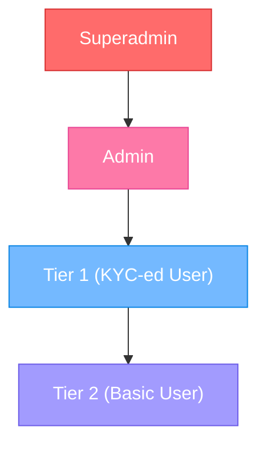
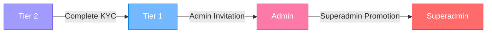

# User Tier System Documentation

## 1. User Hierarchy Overview

Our system implements a 4-tier hierarchical user structure designed to provide scalable access control and feature distribution:



## 2. User Tier Definitions

### 2.1 Superadmin

**Definition**: Highest privileged user with complete system control and oversight responsibilities.

**Key Characteristics**:

* System-wide access and configuration control

* Unrestricted user management capabilities

* Audit trail oversight

* Emergency system intervention rights

**Registration Method**: Manual system initialization only (cannot be created through normal registration)

### 2.2 Admin

**Definition**: Administrative user responsible for daily operations and user management.

**Key Characteristics**:

* Operational system management

* User supervision and support

* Content moderation capabilities

* Limited system configuration access

**Registration Method**: Superadmin invitation/creation only

### 2.3 Tier 1 (KYC-ed User)

**Definition**: Verified users who have completed identity verification through Know Your Customer process.

**Key Characteristics**:

* Identity verified through official documentation

* Access to premium features and services

* Full transaction capabilities

* Enhanced trust level within the system

**Registration Method**: Complete KYC verification process after Tier 2 registration

### 2.4 Tier 2 (Basic User)

**Definition**: Entry-level registered users with basic system access.

**Key Characteristics**:

* Basic profile and interaction capabilities

* Limited feature access

* KYC verification required for upgrade

* Foundation tier for all users

**Registration Method**: Standard email/password registration

## 3. Permission Matrix

| Feature Category       | Superadmin  | Admin           | Tier 1     | Tier 2     |
| ---------------------- | ----------- | --------------- | ---------- | ---------- |
| **System Management**  | <br />      | <br />          | <br />     | <br />     |
| System Configuration   | ✓ Full      | ✓ Limited       | ✗          | ✗          |
| User Management        | ✓ All Users | ✓ Tier 1-2 Only | ✗          | ✗          |
| Audit Log Access       | ✓ Full      | ✓ Operational   | ✗          | ✗          |
| Emergency Controls     | ✓ Full      | ✗               | ✗          | ✗          |
| **User Features**      | <br />      | <br />          | <br />     | <br />     |
| Profile Management     | ✓           | ✓               | ✓ Full     | ✓ Basic    |
| Content Creation       | ✓           | ✓               | ✓          | ✓ Limited  |
| Transaction Processing | ✓           | ✓               | ✓ Full     | ✗          |
| Premium Features       | ✓           | ✓               | ✓          | ✗          |
| **Administrative**     | <br />      | <br />          | <br />     | <br />     |
| User Verification      | ✓           | ✓               | ✗          | ✗          |
| Content Moderation     | ✓           | ✓               | ✗          | ✗          |
| Support Tickets        | ✓           | ✓               | ✓ View Own | ✓ View Own |
| Reports Generation     | ✓ Full      | ✓ Operational   | ✓ Personal | ✗          |

## 4. Upgrade/Downgrade Procedures

### 4.1 Upgrade Path



### 4.2 Upgrade Procedures

#### Tier 2 → Tier 1 (KYC Verification)

1. **Initiation**: User submits KYC request through profile settings
2. **Document Submission**: Upload required identification documents
3. **Verification Process**:

   * Admin reviews submitted documents

   * Identity verification through external services

   * Background check if required
4. **Approval/Rejection**: Admin decision with justification
5. **Tier Assignment**: Automatic upgrade upon approval
6. **Notification**: User receives confirmation email

#### Tier 1 → Admin

1. **Nomination**: Current Admin identifies potential candidate
2. **Superadmin Review**: Superadmin evaluates nomination
3. **Background Check**: Comprehensive verification process
4. **Training**: Admin orientation and system training
5. **Promotion**: Superadmin grants Admin privileges
6. **Documentation**: Record promotion in audit log

#### Admin → Superadmin

1. **Emergency Need**: System requirement for additional Superadmin
2. **Current Superadmin Decision**: Unanimous approval required
3. **System Update**: Direct database modification
4. **Audit Trail**: Complete documentation of promotion
5. **Access Verification**: Confirm new Superadmin capabilities

### 4.3 Downgrade Procedures

#### Voluntary Downgrade

1. **Request Submission**: User submits downgrade request
2. **Confirmation Process**: Double-confirmation to prevent accidents
3. **Data Backup**: Archive user data if applicable
4. **Privilege Revocation**: Remove higher-tier permissions
5. **Notification**: Confirmation of successful downgrade

#### Involuntary Downgrade

1. **Violation Detection**: System/Admin identifies policy violation
2. **Investigation**: Review incident and gather evidence
3. **Due Process**: Provide user opportunity to respond
4. **Decision**: Admin/Superadmin makes final decision
5. **Implementation**: Execute downgrade with audit trail
6. **Appeal Process**: User can appeal decision within 30 days

## 5. Security Protocols

### 5.1 Authentication Requirements

| Tier       | 2FA Required | Session Timeout | Password Complexity                      |
| ---------- | ------------ | --------------- | ---------------------------------------- |
| Superadmin | Mandatory    | 15 minutes      | Maximum (16+ chars, special, mixed case) |
| Admin      | Mandatory    | 30 minutes      | High (12+ chars, special, mixed case)    |
| Tier 1     | Recommended  | 60 minutes      | Standard (8+ chars, mixed case)          |
| Tier 2     | Optional     | 120 minutes     | Basic (8+ chars)                         |

### 5.2 Access Control Measures

#### Superadmin Security

* **IP Whitelisting**: Access only from approved IP addresses

* **Hardware Token**: Physical security key requirement

* **Audit Trail**: Every action logged with timestamp and details

* **Emergency Lockout**: Ability to lock entire system

* **Backup Access**: Multiple authentication methods

#### Admin Security

* **VPN Requirement**: Must connect through corporate VPN

* **Regular Review**: Monthly access review by Superadmin

* **Activity Monitoring**: Real-time suspicious activity detection

* **Privilege Separation**: No access to Superadmin-only functions

#### Tier 1 Security

* **KYC Verification**: Government ID verification required

* **Transaction Limits**: Daily/monthly transaction caps

* **Device Registration**: Limited number of authorized devices

* **Fraud Detection**: Automated monitoring for suspicious patterns

#### Tier 2 Security

* **Email Verification**: Confirmed email address required

* **Basic Monitoring**: Standard security monitoring

* **Upgrade Prompts**: Regular reminders for KYC completion

### 5.3 Data Protection

#### Encryption Standards

* **Data at Rest**: AES-256 encryption for all user data

* **Data in Transit**: TLS 1.3 for all communications

* **Password Storage**: bcrypt with salt and pepper

* **Sensitive Data**: Additional layer of encryption for PII

#### Privacy Controls

* **Data Minimization**: Only collect necessary information

* **Access Logging**: Complete audit trail for data access

* **Right to Deletion**: User data deletion upon request (within legal limits)

* **Data Portability**: Users can export their data

## 6. API Access Levels

### 6.1 API Rate Limits

| Tier       | Requests/Minute | Concurrent Sessions | Special Endpoints |
| ---------- | --------------- | ------------------- | ----------------- |
| Superadmin | 1000            | 10                  | All endpoints     |
| Admin      | 500             | 5                   | Admin endpoints   |
| Tier 1     | 200             | 3                   | User endpoints    |
| Tier 2     | 100             | 2                   | Basic endpoints   |

### 6.2 API Endpoint Access

#### Authentication Endpoints (All Tiers)

```
POST /api/auth/login
POST /api/auth/logout
POST /api/auth/refresh
GET  /api/auth/profile
```

#### User Management Endpoints

```
# Superadmin Only
GET    /api/admin/users
POST   /api/admin/users
PUT    /api/admin/users/{id}
DELETE /api/admin/users/{id}

# Admin Only
GET    /api/admin/users/tier1
GET    /api/admin/users/tier2
PUT    /api/admin/users/{id}/verify
```

#### Transaction Endpoints

```
# Tier 1 and Above
POST /api/transactions/create
GET  /api/transactions/history
GET  /api/transactions/{id}

# Admin and Above
GET  /api/admin/transactions
PUT  /api/admin/transactions/{id}/status
```

#### System Configuration Endpoints

```
# Superadmin Only
GET    /api/admin/config
PUT    /api/admin/config
POST   /api/admin/config/backup
DELETE /api/admin/config/cache
```

## 7. Audit Trail Requirements

### 7.1 Mandatory Audit Events

#### Superadmin Actions

* User privilege changes (promotion/demotion)

* System configuration modifications

* Emergency system interventions

* Database access or modifications

* Security policy changes

#### Admin Actions

* User verification decisions

* Content moderation actions

* Support ticket resolutions

* User complaint handling

* System setting modifications

#### Tier 1 Actions

* Transaction initiations

* Profile modifications

* KYC document submissions

* Premium feature usage

* Support ticket creation

#### Tier 2 Actions

* Account creation

* Login attempts (successful/failed)

* Profile creation

* KYC initiation

* Basic feature usage

### 7.2 Audit Log Retention

| Tier       | Log Retention | Storage Location   | Access Level    |
| ---------- | ------------- | ------------------ | --------------- |
| Superadmin | 7 years       | Encrypted database | Superadmin only |
| Admin      | 5 years       | Encrypted database | Admin and above |
| Tier 1     | 3 years       | Standard database  | User and above  |
| Tier 2     | 2 years       | Standard database  | User and above  |

### 7.3 Audit Log Format

```json
{
  "timestamp": "2026-01-18T10:30:00.000Z",
  "user_id": "uuid",
  "user_tier": "admin",
  "action": "user_promotion",
  "target_user_id": "uuid",
  "previous_tier": "tier1",
  "new_tier": "admin",
  "ip_address": "192.168.1.1",
  "user_agent": "Mozilla/5.0...",
  "success": true,
  "reason": "Operational requirements",
  "session_id": "uuid"
}
```

## 8. Compliance and Legal Requirements

### 8.1 Data Protection Compliance

* **GDPR Compliance**: Right to access, rectify, and delete personal data

* **CCPA Compliance**: California Consumer Privacy Act requirements

* **KYC Regulations**: Anti-money laundering and identity verification standards

* **Data Localization**: Store user data within appropriate jurisdictions

### 8.2 Reporting Requirements

* **Monthly Reports**: User tier distribution and changes

* **Quarterly Reviews**: Security incident and audit summary

* **Annual Assessment**: Complete system security and compliance review

* **Incident Reports**: Immediate reporting for security breaches

## 9. Support and Escalation

### 9.1 Support Tier Assignment

* **Tier 2 Users**: Basic support through help center and email

* **Tier 1 Users**: Priority support with faster response times

* **Admin Users**: Direct line to technical team

* **Superadmin Users**: Immediate escalation to development team

### 9.2 Escalation Matrix

```
Tier 2 → Tier 1: KYC completion and verification
Tier 1 → Admin: Admin nomination and approval
Admin → Superadmin: Critical system issues only
All Tiers → Emergency: Security incidents and system outages
```

This documentation serves as the comprehensive guide for understanding and managing the user tier system. All system administrators and developers should familiarize themselves with these requirements before implementing or modifying user access controls.
