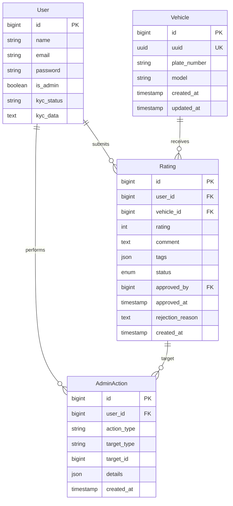

# Database Schema Documentation

## Overview
The database uses a relational model designed to link Users, Vehicles, and Ratings.

## Entity-Relationship Diagram (ERD)

## Tables

### 1. `users`
Stores user account information and KYC status.

| Column | Type | Description |
| :--- | :--- | :--- |
| `id` | BIGINT | Primary Key |
| `name` | STRING | User's full name |
| `email` | STRING | Unique email address |
| `password` | STRING | Hashed password |
| `role` | ENUM | Role: `superadmin`, `admin`, `tier_1`, `tier_2`, `user` |
| `kyc_status` | STRING | Status: `none`, `pending`, `approved`, `rejected` |
| `kyc_data` | TEXT | JSON string containing document metadata |
| `kyc_submitted_at` | TIMESTAMP | When the KYC request was made |
| `kyc_verified_at` | TIMESTAMP | When the KYC was approved |

### 2. `vehicles`
Stores information about vehicles tracked by the system.

| Column | Type | Description |
| :--- | :--- | :--- |
| `id` | BIGINT | Primary Key |
| `uuid` | UUID | Unique Universal Identifier (Indexed) |
| `plate_number` | STRING | Unique license plate (e.g., "B1234XYZ") |
| `model` | STRING | Vehicle model/make (optional) |
| `created_at` | TIMESTAMP | Record creation time |
| `updated_at` | TIMESTAMP | Last update time |

### 3. `ratings`
Stores reports and ratings submitted by users against vehicles.

| Column | Type | Description |
| :--- | :--- | :--- |
| `id` | BIGINT | Primary Key |
| `user_id` | BIGINT | Foreign Key -> `users.id` |
| `vehicle_id` | BIGINT | Foreign Key -> `vehicles.id` |
| `rating` | INTEGER | Score from 1 (Bad) to 5 (Good) |
| `comment` | TEXT | Detailed description of the incident |
| `tags` | JSON | Array of tags (e.g., `["speeding", "safe"]`) |
| `is_honest` | BOOLEAN | User declaration of truthfulness |
| `status` | ENUM | `pending` (default), `approved`, `rejected` |
| `approved_by` | BIGINT | Foreign Key -> `users.id` (Admin who verified) |
| `approved_at` | TIMESTAMP | When the rating was verified |
| `rejection_reason` | TEXT | Reason for rejection (if applicable) |
| `created_at` | TIMESTAMP | When the report was filed |

### 4. `admin_actions`
Logs administrative actions performed on the platform.

| Column | Type | Description |
| :--- | :--- | :--- |
| `id` | BIGINT | Primary Key |
| `user_id` | BIGINT | Foreign Key -> `users.id` (Admin) |
| `action_type` | STRING | Type of action (e.g., `approve_rating`, `reject_rating`) |
| `target_type` | STRING | Polymorphic relation type (e.g., `App\Models\Rating`) |
| `target_id` | BIGINT | Polymorphic relation ID |
| `details` | JSON | Additional metadata (e.g., rejection reason) |
| `created_at` | TIMESTAMP | When the action occurred |
