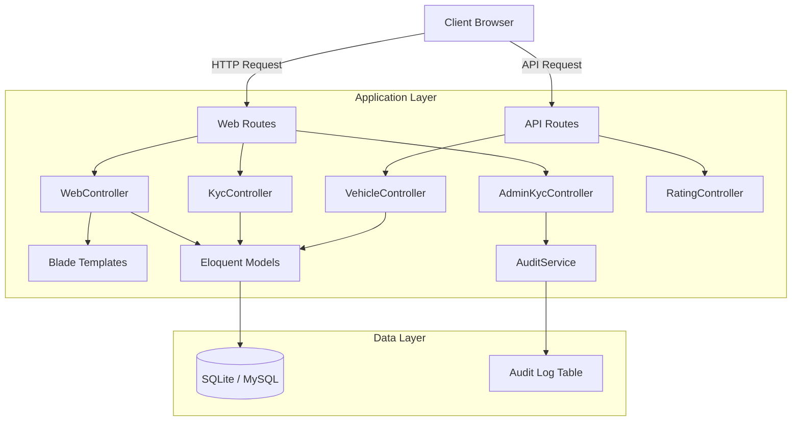

# MATAJALAN_OS // Surveillance System

## 1. Project Overview
**MATAJALAN_OS** is a next-generation surveillance and vehicle rating platform designed to crowd-source traffic safety data. It provides a cyberpunk-themed interface for users to report vehicle behavior, track high-threat targets, and verify their identity through a KYC (Know Your Customer) process.

### Vision Statement
To create a decentralized, transparent, and gamified surveillance network that empowers citizens to contribute to road safety through real-time data reporting and analysis.

## 2. System Architecture
The project follows the standard **Model-View-Controller (MVC)** architectural pattern provided by the Laravel framework.



## 3. Technology Stack
- **Backend Framework:** Laravel 12.0 (PHP 8.2+)
- **Frontend:** Blade Templates, Tailwind CSS v3.4, Alpine.js
- **Database:** SQLite (Development), MySQL 8.0+ (Production)
- **Authentication:** Laravel Breeze (Sanctum for API)
- **Testing:** Pest PHP
- **Build Tool:** Vite

## 4. Key Features
- **Vehicle Surveillance**: Search and view vehicle profiles with safety scores.
- **Rating System**: Crowdsourced reporting with tagging and threat assessment.
- **KYC Verification**: Multi-tier user clearance (Tier 1/Tier 2) via document upload.
- **Admin Command Center**: Manage KYC requests and view system audits.
- **Audit Trail**: Full logging of sensitive administrative actions.

## 5. Setup and Installation

### Prerequisites
- PHP >= 8.2
- Composer
- Node.js & NPM

### Installation Steps
1. **Clone the repository:**
   ```bash
   git clone https://github.com/your-org/matajalan-os.git
   cd matajalan-os
   ```

2. **Install PHP dependencies:**
   ```bash
   composer install
   ```

3. **Install Node.js dependencies:**
   ```bash
   npm install
   ```

4. **Environment Configuration:**
   Copy the example environment file and configure it:
   ```bash
   cp .env.example .env
   php artisan key:generate
   ```

5. **Database Setup:**
   Create the SQLite database file (if using SQLite):
   ```bash
   touch database/database.sqlite
   ```
   Run migrations:
   ```bash
   php artisan migrate
   ```

6. **Build Assets:**
   ```bash
   npm run build
   ```

## 6. Development Environment
To start the local development server:

```bash
# Start Laravel server
php artisan serve

# Start Vite (in a separate terminal)
npm run dev
```

Access the application at `http://localhost:8000`.

## 7. Configuration
Key configuration files located in `config/`:
- `app.php`: Application name, locale, and providers.
- `database.php`: Database connection settings.
- `auth.php`: Authentication guards and providers.

Refer to `.env` for environment-specific variables.
